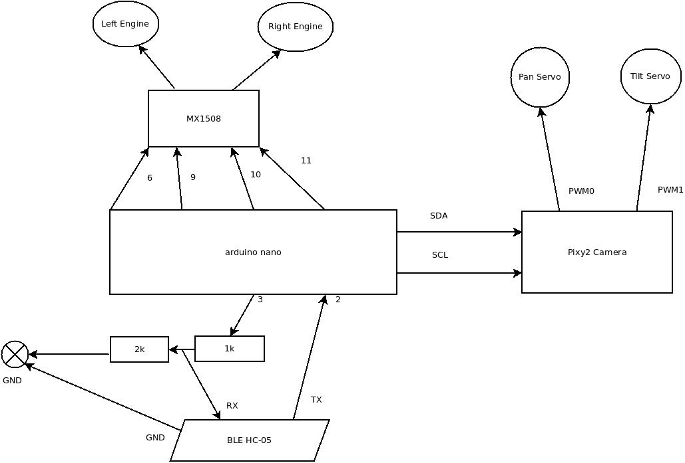
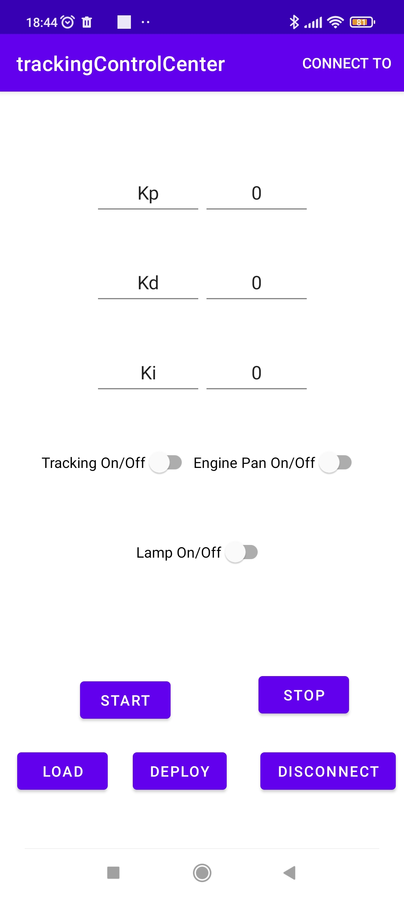

# pixy2Droid

Droid using pixy2 camera

## Pan Tilt Tracking Camera

Pixy2 camera is used for Tracking using PID for engines (left/right) or servos.

### Commands:

h# print the menu

S# Start

s# Stop

T# tracking on

t# tracking off

L# lamp on/off

E# engine pan tracking on/off

pxx# horizontal position of camera

Pxx# set Kp

P# get Kp

Ixx# set Ki

I# get Ki

Dxx# set Kd

D# get Kd

Android application:

## AutoMove

Pixy2 camera is used to read bar codes from the ground, those code instruct the droid how to move.

0 is left

3 is bacward

4 is forward

5 is right

6 is delay (stop 10000 ms)

### Commands:

h# print menu

s# stop/start

l# lights on

a# autocalibration

L# left with turn90 delay

R# right with turn90 delay

txxx# set turn90

sxxx,xxx# set servo tilt,pan

vxxx# set the current power

## PIXY2 links

[pixy2 pinout](https://docs.pixycam.com/wiki/doku.php?id=wiki:v2:port_pinouts)

[pixy2 power](https://docs.pixycam.com/wiki/doku.php?id=wiki:v2:powering_pixy)

[pixy2 general api](https://docs.pixycam.com/wiki/doku.php?id=wiki:v2:general_api)

[pixy2 line api](https://docs.pixycam.com/wiki/doku.php?id=wiki:v2:line_api)

[pixy2 line tracking](https://docs.pixycam.com/wiki/doku.php?id=wiki:v2:line_tracking)

[pixy2 github](https://github.com/charmedlabs/pixy2)

[all barcodes](https://github.com/charmedlabs/pixy2/raw/master/documents/other/all_codes.pdf)

